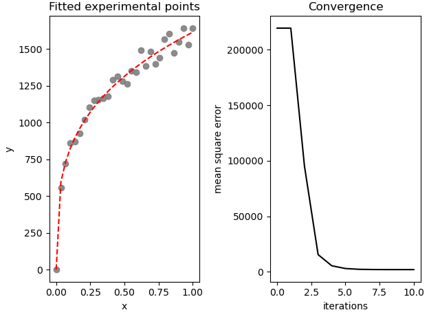

# Levenberg-Marquardt

Python implementation of Levenberg-Marquardt algorithm built from scratch in Numpy.

In the example, I fit an mechanical hardening law (Hollomon: $σ = K * ε^n$) to noisy generated points:

`scipy.optimize.least_squares` works great when you have the raw function for every points (`y = ax + b`), which is not always the case (ie. black box function or iterative stress compute).

Some references:
- https://people.duke.edu/~hpgavin/ExperimentalSystems/lm.pdf
- http://ananth.in/docs/lmtut.pdf
- https://docs.mrpt.org/reference/latest/page_tutorial_math_levenberg_marquardt.html
